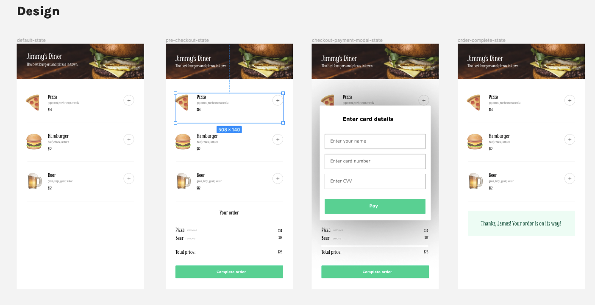

## Restaurant Ordering App

### The challenge:

In Scrimba's Front End Developer course, I built a solo project called Restaurant Ordering App with HTML, CSS and JavaScript. This time I am creating the project in React instead.

In summary, the app allows customers to view the menu, add items to their order, complete the order by entering payment details, and receive a thank-you message once the payment is successfully submitted. Each component has a specific role in managing different aspects of the ordering process.

### Figma screen-shot:

### Process

- Consult Figma design files
- Create draft of README file
- Work on HTML, CSS, React JSX and components
- Check final code and accessibility
- Finalize README file
- Publish live URL

### Project code solutions - reminders and thoughts along the way

- Use background-image for header
- Use wrapper to center the menu and order components
- Place emojis in a span and increase size with font-size
- Use the .join(", ") method for listing the ingredients

### Add to project

- Display number of items ordered next to item name
- Add a remove button, if user changes his/her mind
- Ensure that the input is valid in the payment modal/component

### Overview

#### `App` Component:

- The `App` component is the main control center of the restaurant ordering app.
- It keeps track of the items a customer wants to order (`orderItems` state) and whether the payment process is in progress or completed (`showPaymentModal` and `isPaymentCompleted` states).
- It also stores the customer's name (`customerName` state).

#### `Menu` Component:

- The `Menu` component displays a list of menu items that customers can choose from.
- Each menu item has an emoji, name, ingredients, and price.
- Customers can add items to their order by clicking the "+" button next to each menu item.

#### `Order` Component:

- The `Order` component shows a summary of the customer's order.
- It calculates the total price based on the selected items and their quantities.
- If there are items in the order, it displays their names, prices, and the total order price.
- There's a button to complete the order.

#### `Payment` Component:

- The `Payment` component is a modal where customers enter their payment details.
- It includes fields for the customer's name, card number, and CVV.
- When the customer submits the payment details, it triggers the `handlePaymentSubmit` function in the `App` component.

#### `ThankYou` Component:

- The `ThankYou` component displays a message to the customer, thanking them for their order.
- It includes the customer's name in the message.
- This component is shown when the payment is completed.

#### State Management:

- The `useState` hook from React is used to manage state variables like `orderItems`, `showPaymentModal`, `isPaymentCompleted`, and `customerName`.
- Functions like `addToOrder`, `handleCompleteOrder`, and `handlePaymentSubmit` update these states based on user interactions.

#### PropTypes:

- PropTypes are used to define the expected types of props that each component should receive. For example, `Menu` expects a function `addToOrder` and an array `menuItemArray`.
